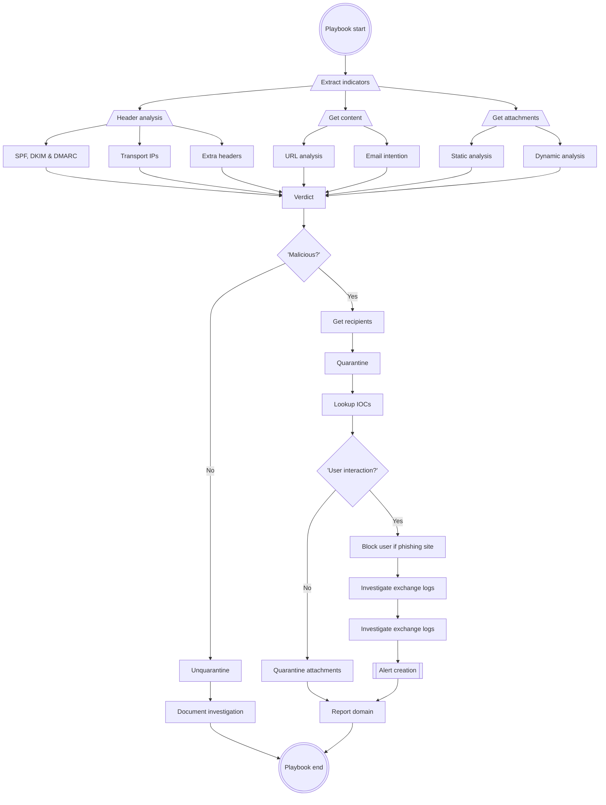

## Reported phishing
This investigation playbook defines some actions to analyse an email when a potential phishing is reported

```mermaid
flowchart TB
  jchzy(((Playbook start)))
  jchzy-->pbvpb[/Extract indicators\]
  pbvpb-->pzlco[/Header analysis\]
  pbvpb-->phqfy[/Get content\]
  pbvpb-->mapsh[/Get attachments\]
  pzlco-->eiyiq[SPF, DKIM & DMARC]
  pzlco-->chvwr[Transport IPs]
  pzlco-->xjgcg[Extra headers]
  phqfy-->onxpb[URL analysis]
  phqfy-->onfbn[Email intention]
  mapsh-->wercd[Static analysis]
  mapsh-->oqfop[Dynamic analysis]
  eiyiq-->gbocp[Verdict]
  chvwr-->gbocp[Verdict]
  xjgcg-->gbocp[Verdict]
  onxpb-->gbocp[Verdict]
  onfbn-->gbocp[Verdict]
  wercd-->gbocp[Verdict]
  oqfop-->gbocp[Verdict]
  gbocp-->pzatg{'Malicious?'}
  pzatg-->|Yes| vbjci[Get recipients]
  pzatg-->|No| rnkik[Unquarantine]
  vbjci-->qkxry[Quarantine]
  rnkik-->secls[Document investigation]
  qkxry-->rongl[Lookup IOCs]
  secls-->njaav(((Playbook end)))
  rongl-->jxpza{'User interaction?'}
  jxpza-->|Yes| bwiml[Block user if phishing site]
  jxpza-->|No| prjrv[Quarantine attachments]
  bwiml-->khubk[Investigate exchange logs]
  prjrv-->njfxb[Report domain]
  khubk-->xpjij[Investigate exchange logs]
  njfxb-->njaav(((Playbook end)))
  xpjij-->fulun[[Alert creation]]
  fulun-->njfxb[Report domain]
```
