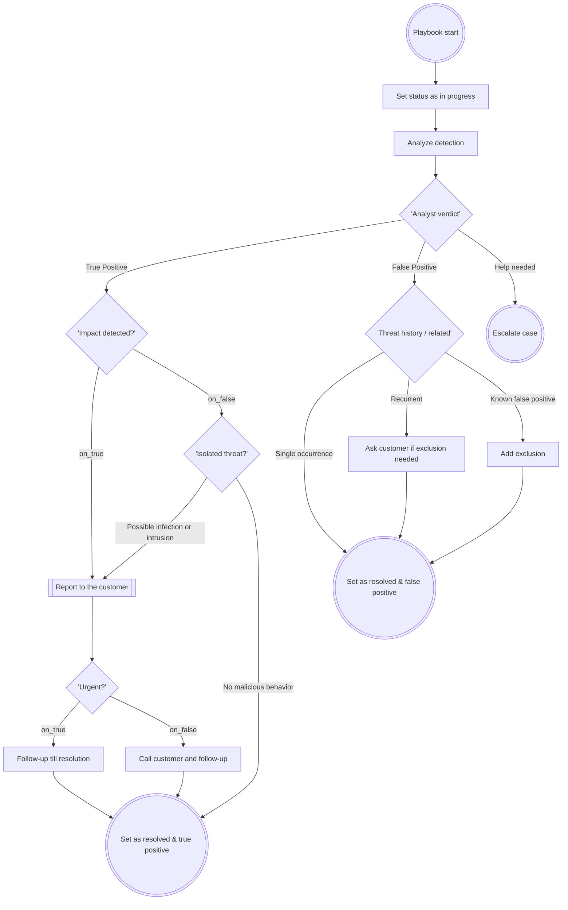

## Threat mitigated playbook
This investigation playbook defines which actions to take when investigating a threat detected by the EDR SentinelOne

```mermaid
flowchart TB
  cetbo(((Playbook start)))
  cetbo-->lhtua[Set status as in progress]
  lhtua-->cpsrq[Analyze detection]
  cpsrq-->atmps{'Analyst verdict'}
  atmps-->|True Positive| dexkk{'Impact detected?'}
  atmps-->|False Positive| xqzpa{'Threat history / related'}
  atmps-->|Help needed| hsbrg(((Escalate case)))
  dexkk-->|on_true| zitzt[[Report to the customer]]
  dexkk-->|on_false| nklbw{'Isolated threat?'}
  xqzpa-->|Single occurrence| uevht(((Set as resolved & false positive)))
  xqzpa-->|Recurrent| tkjnh[Ask customer if exclusion needed]
  xqzpa-->|Known false positive| pilyk[Add exclusion]
  zitzt-->jfwog{'Urgent?'}
  nklbw-->|Possible infection or intrusion| zitzt[[Report to the customer]]
  nklbw-->|No malicious behavior| bpmjj(((Set as resolved & true positive)))
  tkjnh-->uevht(((Set as resolved & false positive)))
  pilyk-->uevht(((Set as resolved & false positive)))
  jfwog-->|on_true| xlgau[Follow-up till resolution]
  jfwog-->|on_false| nkeif[Call customer and follow-up]
  xlgau-->bpmjj(((Set as resolved & true positive)))
  nkeif-->bpmjj(((Set as resolved & true positive)))
```
